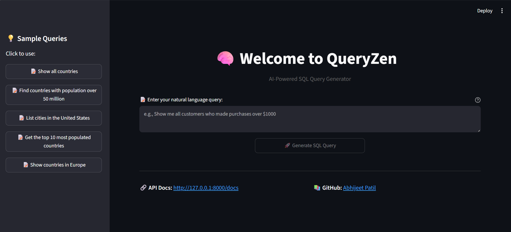
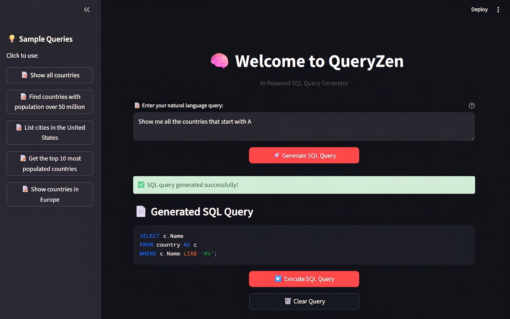
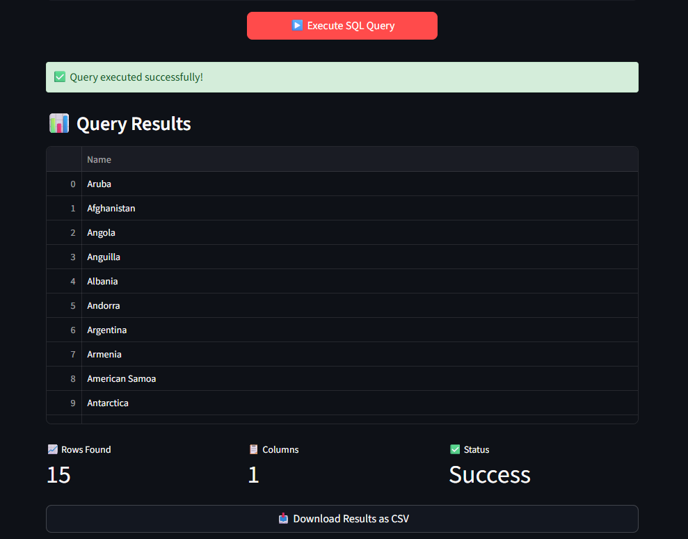

# 🧠 QueryZen: AI-Powered SQL Generator

Transform **natural language into optimized SQL queries** with AI-driven intelligence. QueryZen combines the power of **GPT-4**, **FastAPI**, and **Streamlit** to make database querying accessible to everyone.

[](https://python.org)
[](https://fastapi.tiangolo.com)
[](https://openai.com)
[](https://mysql.com)
---

## 🎯 What QueryZen Does

**Input:** _"Show me all customers who purchased more than $1000 worth of products last month"_

**Output:** Optimized, read-only SQL query + execution results + performance recommendations

---

## ✨ Key Features

- 🤖 **AI-Powered Translation** - Convert plain English to optimized SQL using GPT-4
- ⚡ **Smart Query Execution** - Run queries safely with built-in validation
- 🛡️ **Read-Only Safety Guard** - Only `SELECT`/`WITH` statements ever reach the database; mutating statements (`INSERT`, `UPDATE`, `DELETE`, `DROP`, etc.) are blocked before execution
- 🔍 **Performance Analysis** - Get execution plans and indexing recommendations via `EXPLAIN`
- 🎨 **Interactive Web UI** - User-friendly Streamlit interface
- 🚀 **REST API Ready** - FastAPI backend with interactive Swagger docs
- 📊 **Auto Row Limiting** - Generated queries are automatically capped to a safe row count
- ✅ **Query Validation** - Syntax and safety checking before anything runs

---

## Screenshots of Work

### UI

<div align="center">
  
</div>

### Query Generation

<div align="center">
  
</div>

### Query Execution

<div align="center">
  
</div>

---

## 🏗️ How It Works

```
Natural Language Input
        │
        ▼
┌─────────────────┐      reads schema      ┌──────────────┐
│  Streamlit UI    │ ───────────────────▶   │   MySQL DB   │
└─────────────────┘                         └──────────────┘
        │ POST /generate_sql/                       ▲
        ▼                                            │
┌─────────────────┐      GPT-4 prompt      ┌──────────────┐
│   FastAPI API    │ ───────────────────▶   │  OpenAI API  │
└─────────────────┘  ◀───────────────────   └──────────────┘
        │              generated SQL
        │ safety check + LIMIT guard
        ▼
┌─────────────────┐      EXPLAIN + exec     ┌──────────────┐
│ Query Validator  │ ───────────────────▶    │   MySQL DB   │
└─────────────────┘  ◀───────────────────    └──────────────┘
        │           results + optimization tips
        ▼
   Results shown in Streamlit UI
```

---

## 🚀 Quick Start

### Prerequisites

- Python 3.8+
- MySQL 8.0+
- OpenAI API Key

### 1️⃣ Installation

```bash
git clone https://github.com/yourusername/AI-SQL-Query-Generator.git
cd QueryZen

# Create virtual environment
python -m venv venv
source venv/bin/activate  # Linux/macOS
# venv\Scripts\activate   # Windows

# Install dependencies
pip install -r requirements.txt
```

### 2️⃣ Configuration

Copy the example env file and fill in your own values:

```bash
cp .env.example .env
```

```env
# Database Configuration
MYSQL_HOST=localhost
MYSQL_USER=root
MYSQL_PASSWORD=your_password
MYSQL_DATABASE=your_database
MYSQL_PORT=3306

# OpenAI Configuration
OPENAI_API_KEY=your_openai_api_key_here
OPENAI_MODEL=gpt-4o
```

### 3️⃣ Launch Application

```bash
# Terminal 1 — start the FastAPI backend
python -m uvicorn app:app --reload --host 127.0.0.1 --port 8000

# Terminal 2 — start the Streamlit frontend
python -m streamlit run ui.py
```

### 4️⃣ Access the Application

- **Web Interface:** http://localhost:8501


---

## 💡 Usage Examples

### Natural Language Queries

```
✅ "Find all orders placed in the last 30 days"
✅ "Show me the top 5 customers by total purchase amount"
✅ "List products that are running low on inventory"
✅ "Get monthly revenue trends for this year"
```

---

## 📁 Project Structure

```
QueryZen/
├── app.py                 # FastAPI application
├── query_generator.py     # Core AI logic + safety validation
├── database.py             # Database connection & schema introspection
├── ui.py                   # Streamlit interface
├── requirements.txt        # Python dependencies
├── .env.example             # Environment variable template
├── .gitignore                # Git ignore rules
└── README.md                   # This file
```

---

## 🛡️ Safety

QueryZen only ever generates and executes **read-only `SELECT`/`WITH` statements**. Any query - whether AI-generated or manually submitted through the API - that contains mutating keywords (`INSERT`, `UPDATE`, `DELETE`, `DROP`, `ALTER`, `TRUNCATE`, `CREATE`, `GRANT`, etc.) is rejected before it ever reaches the database. Queries without an explicit `LIMIT` are automatically capped (`DEFAULT_ROW_LIMIT`, default 200 rows) to keep things fast and safe against accidentally scanning huge tables.

---

## 🔧 Configuration Options

### Database Support

- **MySQL** (default, fully implemented)
- PostgreSQL / SQL Server / Snowflake (drivers scaffolded - swap the SQLAlchemy connection string in `database.py` to extend)

### AI Models

Configurable via `OPENAI_MODEL` in `.env`:

- **gpt-4o** (recommended - default)
- **gpt-4** (higher cost, comparable quality)
- **gpt-4o-mini** (faster, cheaper - good for demos)

---

## 🗺️ Roadmap

- [ ] PostgreSQL support
- [ ] Query history & saved queries
- [ ] Authentication for the API
- [ ] Docker Compose setup for one-command local demo
- [ ] Streaming responses in the UI

---

## 🤝 Contributing

Contributions are welcome! Feel free to open an issue or submit a pull request.

1. Fork the repo
2. Create a feature branch (`git checkout -b feature/my-feature`)
3. Commit your changes (`git commit -m "Add my feature"`)
4. Push to the branch (`git push origin feature/my-feature`)
5. Open a Pull Request

---

## 👤 Author

[@abhiee-9](https://github.com/abhiee-9)
